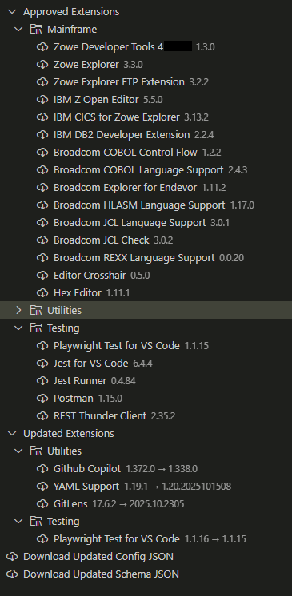

# VS Code Private Marketplace

My solution to the lack of a native VS Code private extension marketplace (as of time of release) and allows a central authority in an org to control which extensions and extension versions that users may install. 

Made specifically for the mainframe department (~200 devs).

All references and code from my org has been clensed from this repository, but I do not expect anyone to use it.

## Distribution

`extension` folder is for the VS Code extension side which is installed per user.

Install this using group policy onto all users' VS code installs in specific AD group.

`repository` folder is for the bit that goes onto the Azure DevOps repository. Users must have access to read this repository. All authentication is done through the browser.