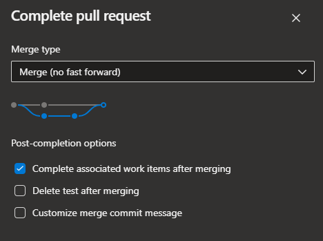
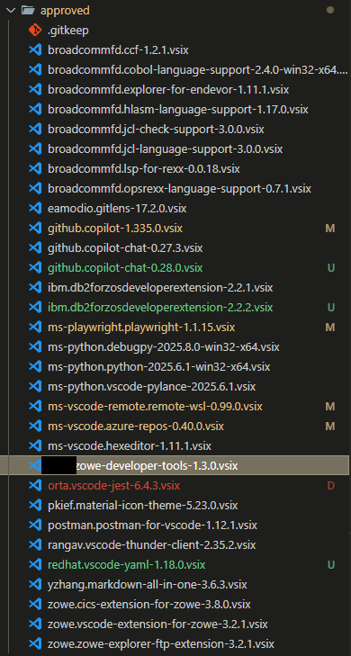

# VS Code Private Marketplace (Repository)

Private extension repository for controlling distributed extension versions.

## How to obtain VSIX files

### Easiest method
1. Go to the [OpenVSX](https://open-vsx.org/) website.
2. Search for the extension to download.
3. Download the button for the selected version of an extension.
4. If it asks for a platform, either `All platforms` or `Windows x64` if the option is available.
5. Once all extension updates are downloaded, move the files into the `approved` folder.

### Slightly more annoying method
1. Make sure you are on VS Code version `1.101.0` or newer.
2. Navigate to public extensions marketplace.
3. Right click on the extension (can be installed or not installed) and click `Download VSIX` to get latest version or `Download Specific Version VSIX`.
4. If it asks for a platform, either `All platforms` or `Windows x64` if the option is available.
5. Download into `approved` folder.

## Workflow for adding/updating/deprecating extensions

1. Checkout `test` branch.
2. Upload new VSIX files to the `approved` folder.
3. **(Optional but mostly automates the following steps):** Run `python .azure/auto_update.py` and update any missing catagories if necessary. 
4. Update `extensions.json` file to match the new files in `approved` folder. `packageName` MUST match the names of the uploaded VSIX files. Category can be anything or not need to be there at all and it will just group it under "Other".
5. Commit your changes to the repo.
6. In the private marketplace extension, switch to test mode by entering `Toggle Test Mode` into the command palette. This will fetch packages from the `test` branch so you can check your changes are working.
7. Just before merging, squash your changes into one commit. This will allow the report workflow to detect all changes to `extensions.json` (the PR will fail if it is not one commit anyway). See section at the bottom on how to `git squash`.
8. Merge the `test` branch into the `main` branch. **Do NOT delete the `test` branch!** If you do by accident, immediately add it back with the same name:



Also do not rename `main` as the extension will break (it has to look for `extensions.json` in `main` branch to fetch extension details).

The main properties of `extensions.json` are:
- **approvedExtensionsPath**: The relative path to the approved extensions folder in this repo.
- **approvedExtensions**: The entries for extension packages in `approved` folder.
- **extraWhitelist**: Extensions that have not got an approved VSIX file but are still allowed to be installed from the public extension marketplace. This is good for extension packs that may create undesirable behaviour by being available to download in the private marketplace but contains approved extensions.
- **allowAllVersions**: Extensions that update frequently and/or version mismatches are highly dependent on the user's VS Code version and/or we know all versions are safe to use.

Note, you can decide the order the extensions are shown in the list by the placement in the extensions array. So it is nice to group together Broadcom extensions, IBM extensions, testing extensions, etc.

## Linter

When you are done with your changes, in your open PR Azure will run a workflow which lints your files to check for any mismatches. For example:

| Type | VSIX file | packageName | Details |
|------|-----------|-------------|---------|
| Missing in extensions.json | zowe.vscode-extension-for-zowe-3.2.1.vsix |  | zowe.vscode-extension-for-zowe-3.2.1.vsix not found in extensions.json |
| Missing in extensions.json | ms-vscode-remote.remote-wsl-0.99.0.vsix |  | ms-vscode-remote.remote-wsl-0.99.0.vsix not found in extensions.json |
| Missing VSIX file |  | msms-vscode-remote.remote-wsl-0.99.0 | msms-vscode-remote.remote-wsl-0.99.0 not found in approved folder |

Looking at the issues, the `packageName` entry is typo'd as `msms-vscode.remote` instead of `ms-vscode.remote` as the org name and the Zowe Explorer entry is missing in `extensions.json`.

This will fail the pipeline and you should fix this before merging the PR.

You can manually run the lint script locally with `python lint.py` in command line (assuming you have python installed).

Fixing the issues, the pipeline will run successfully with `✅ All VSIX files and extensions.json entries are consistent.`

### For example

Consider the changes in the following image (the colours are provided by the basic VS Code git integration):



The green files are new extension files. These represent either new versions or entirely new extensions.

For example you can see that `github.copilot-chat-0.27.3` has been updated to `github.copilot-chat-0.28.0`. In this case simply rename the `packageName` in the `extensions.json` entry for the extension:
```json
{
    "name": "Github Copilot Chat",
    "packageName": "github.copilot-chat-0.27.3",
    "category": "Utilities"
}
```
becomes
```json
{
    "name": "Github Copilot Chat",
    "packageName": "github.copilot-chat-0.28.0",
    "category": "Utilities"
}
```

The yellow files are updated internally but version has not actually changed. You do not need to do anything for these.

The red file is deleted, so you need to delete the entry for this file in the `extensions.json` file.

## How it works

The main ideas are:
- The extension does not need to be updated every time packages on this repo change, as that would be a nightmare. It should be as easy as possible to manage this private marketplace.
- All authentication is done by the user simply by opening the download links in the browser where users are/can be authenticated as they already use Azure for agile etc. The extension is unable to simply request file content by https request as the user would have to enter their Azure credentials including 2FA codes in the extension somewhere. This would be a huge pain for all users to setup and use.
- `extensions.json` cannot be edited by users to "fetch" the extensions they want as if it already exists in Downloads folder, it is deleted then immediately accessed. If the file is deleted afterwards it doesn't matter.

The extension works like this:
1. Tree view starts with button to fetch extension info.
2. Click to fetch `extensions.json` from repo.
3. Poll for `extensions.json` in downloads folder. If not found show error message.
4. Read content and construct tree & download URLs from the provided info.
5. Tree view is populated with this data.
6. Click to download each extension.
7. Poll for VSIX file in downloads folder for up to 30 seconds.
8. If VSIX file found, install it.
9. If VSIX file not found, show warning message (likely user error etc).

## Download link construction

Consider the following download URL (not a real one but yours will look similar):

> `https://dev.azure.com/ADO-Project/22844d09-29df-3a0d-bff7-39ad061d525a/_apis/git/repositories/22844d09-29df-3a0d-bff7-39ad061d525a/items?path=/approved/vscode-zowe-developer-tools-1.3.0.vsix&versionDescriptor%5BversionOptions%5D=0&versionDescriptor%5BversionType%5D=0&versionDescriptor%5Bversion%5D=test&resolveLfs=true&%24format=octetStream&api-version=5.0&download=true`

- This is the URL to the Azure git repository: `https://dev.azure.com/ADO-Project/22844d09-29df-3a0d-bff7-39ad061d525a/_apis/git/repositories/22844d09-29df-3a0d-bff7-39ad061d525a`
- This is the query to fetch items and the path to download from `/items?path=`
- This is the actual path of the file to download `/approved/vscode-zowe-developer-tools-1.3.0.vsix`
- This is some fluff in the middle. It never changes `&versionDescriptor%5BversionOptions%5D=0&versionDescriptor%5BversionType%5D=0&versionDescriptor%5Bversion%5D=`
- This describes the branch name the file is located on `test`
- This tells it to download the file as a raw binary file on API version 5.0. It also never changes `&resolveLfs=true&%24format=octetStream&api-version=5.0&download=true`

## When the extension must be updated

1. If you want to change the repository contaning `extensions.json` file and VSIX files
2. If you want to change the names of `main` or `test` branches
3. If you want to change the name of `extensions.json` file or any top level fields inside of it